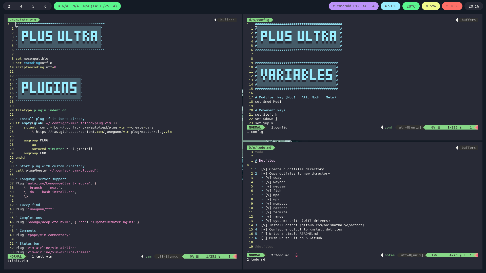
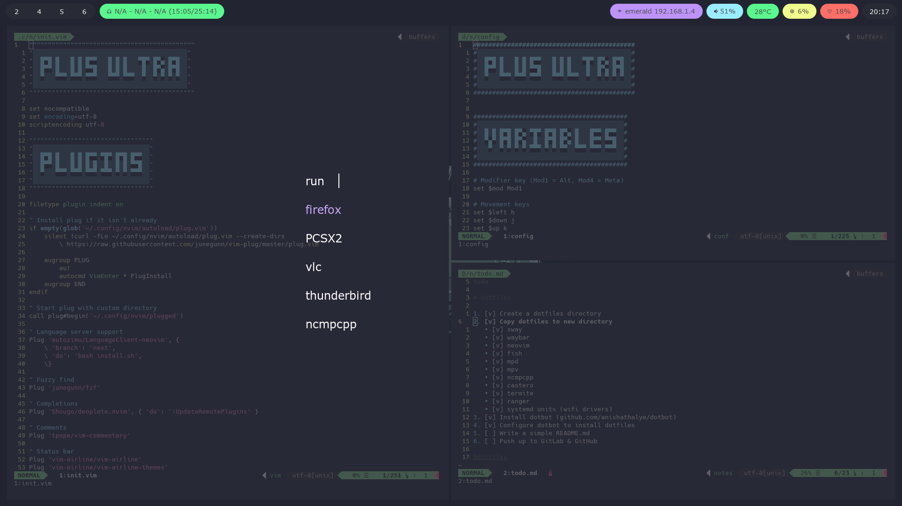

# PLUS ULTRA!

## Screenshots






## Install

To install these dotfiles, simply clone and then run [dotbot](https://github.com/anishathalye/dotbot).

```shell
git clone https://github.com/jakehamilton/dotfiles ~/dotfiles

cd ~/dotfiles

# `sudo` is required to install kernel module configuration
sudo ./install
```

You'll likely also want to grab the right fonts from [Nerd Fonts](https://nerdfonts.com).

## Install (individually)

If you do not want all of these configuration files, you can install the ones
you do want manually by either copying them or linking them to their
destination.

### Copying

For example, to install neovim configuration

```shell
mkdir -p ~/.config/nvim

cp ~/dotfiles/neovim/* ~/.config/nvim/
```

### Linking

For example, to install neovim configuration

```shell
mkdir -p ~/.config/nvim

ln -s ~/dotfiles/neovim/init.vim ~/.config/nvim/init.vim
```
